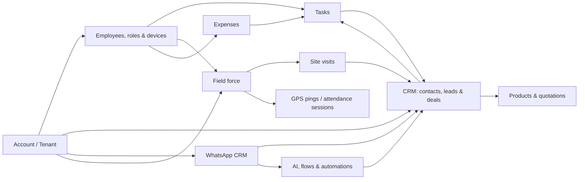
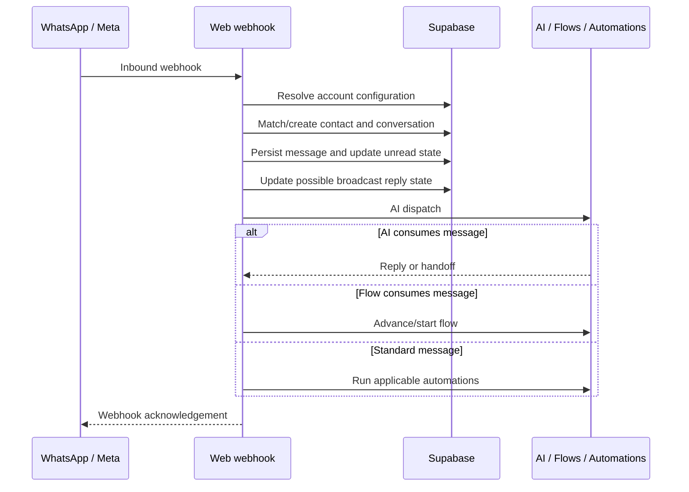

# WACRM Bible

> **Purpose:** The single source of truth for WACRM product support, product planning, module design, implementation standards, and technical onboarding.
>
> **Evidence date:** 2026-07-13. This document is derived from the WACRM web repository, companion field-force mobile repository, and Supabase migrations. It records implemented behavior. Items marked **Decision needed** require product-owner confirmation before being promised to customers.

## 1. Product Identity

WACRM is a multi-tenant business operating platform. Its core combines CRM and WhatsApp engagement with field-force operations: employee task work, attendance/punch sessions, GPS tracking, site visits, and expense claims.

### Product positioning

- **Primary current platform:** CRM + WhatsApp CRM + Field Force Tracking.
- **Primary users:** account owners/admins, office teams, sales users, and field employees.
- **Tenant model:** each customer organization is an `account`; its people are `profiles`/employees. Tenant isolation is enforced primarily through Supabase Row Level Security (RLS).
- **Web product:** comprehensive administration and operations platform.
- **Mobile product:** WACRM Field Force, an employee-focused companion—not a full mobile copy of the web CRM.

### Current portfolio

| Area                   | Implemented capability                                          | Web | Mobile                       |
| ---------------------- | --------------------------------------------------------------- | --- | ---------------------------- |
| CRM                    | Contacts, tags, notes, custom fields, activities                | Yes | Contacts and contact editing |
| Leads and sales        | Leads, configurable lead attributes, pipelines, deals           | Yes | Task links to leads/deals    |
| WhatsApp CRM           | Shared inbox, templates, media, reactions, broadcasts           | Yes | No dedicated inbox           |
| Tasks                  | Tasks, comments, checklist, attachments, follow-ups             | Yes | Activities and task editing  |
| Automation             | Rule automations, logs, pending executions                      | Yes | No builder                   |
| WhatsApp flows         | Interactive flows, nodes, runs, events                          | Yes | No builder                   |
| AI knowledge base      | Bot settings, documents, chunks, inbound AI dispatch            | Yes | No dedicated UI              |
| Field Force Tracking   | Consent, punch sessions, GPS pings, map, geofences, site visits | Yes | Core workflow                |
| Expense management     | Expense types, claims, approvals, rates, supporting evidence    | Yes | Submit/edit/view claims      |
| Product and quotations | Products, quotation items, terms, print views                   | Yes | Not exposed                  |
| Platform operations    | Superadmin users, companies, billing, provisioning              | Yes | No                           |

### Future portfolio — decision needed

SFA, HRMS, inventory, assets, service management, helpdesk, payroll, procurement, and similar products are not completed modules in this codebase. Before describing them as WACRM products, decide for each one:

1. standalone product, paid add-on, or extension of an existing module;
2. target customer and user role;
3. data owner and key relationships;
4. price/packaging and limits;
5. whether it belongs in web, mobile, or both.

## 2. Module Map and Relationships

### CRM and sales

- Contacts support tags, notes, address/location additions, relational custom fields, and activity history.
- Leads are separate from contacts and support configurable status, source, industry, notes, custom values, and contact-person association.
- Deals live in pipelines and stages. The dashboard aggregates CRM, pipeline, lead, conversation, and task metrics.
- Tasks can link to contacts, leads, deals, and expenses; task activity writes into related module activity records.
- Products feed quotations. Quotations contain line items, terms templates, custom values, and printing.

### WhatsApp engagement

The WhatsApp webhook resolves the account from WhatsApp configuration, creates or matches the contact and conversation, persists the inbound message, updates unread state, and dispatches AI, flows, and automations. Customer reactions are stored separately. Broadcast recipient aggregates are maintained by database triggers.

### Field force and attendance

The implementation uses `tracking_sessions` as the punch/attendance boundary: a session begins at punch-in, can activate background GPS tracking, and ends at punch-out. Site visits are separate check-in/check-out records that may link to a contact, task, or geofence. There is no standalone `attendance` table in the migrations; support answers should describe attendance as **punch/tracking sessions** unless a later implementation changes this.

### Expenses

Employees submit their own expense claims. Expense types define allowance behavior, proof requirements, rates, and amount changes; administrators approve or reject. A task may reference an expense. Mobile supports submission and edits; the web app provides management.

## 3. Architecture

### Repositories

| System       | Location                                    | Stack                                                |
| ------------ | ------------------------------------------- | ---------------------------------------------------- |
| Web platform | `C:\Users\Xitij\Desktop\wacrm`              | Next.js 16, React 19, TypeScript, Tailwind, Supabase |
| Field app    | `C:\Users\Xitij\Desktop\wacrm-mobile`       | Expo 57, React Native, Expo Router, Supabase         |
| Backend/data | `supabase/migrations` in the web repository | PostgreSQL, Supabase Auth, Storage, Realtime, RLS    |

### Web structure

| Layer            | Responsibility                                  | Examples                                                 |
| ---------------- | ----------------------------------------------- | -------------------------------------------------------- |
| App routes       | Pages and route handlers                        | `src/app/(dashboard)`, `src/app/api`                     |
| Platform admin   | Superadmin administration                       | `src/app/(superadmin)/admin`                             |
| Components       | Domain and reusable visual components           | `src/components/inbox`, `tasks`, `ui`                    |
| Domain libraries | Auth, engines, validation, integration adapters | `src/lib/auth`, `automations`, `flows`, `whatsapp`, `ai` |
| Client hooks     | Realtime, presence, permission, auth helpers    | `src/hooks`                                              |
| Database service | Auth, PostgreSQL, Storage, Realtime             | `src/lib/supabase`, migrations                           |

### External integrations

| Integration             | Purpose                                                |
| ----------------------- | ------------------------------------------------------ |
| Supabase                | Auth, PostgreSQL, tenant RLS, storage, realtime        |
| Meta WhatsApp Cloud API | Webhooks, outbound sends, templates, media, broadcasts |
| Google Generative AI    | AI knowledge-base/bot support                          |
| OpenStreetMap Nominatim | Mobile reverse geocoding                               |
| OpenRouteService        | Mobile driving routes/directions                       |
| Expo/EAS                | Mobile runtime and Android/iOS builds                  |

### WhatsApp inbound lifecycle

## 4. Database and Data Model

The ordered SQL migrations under `supabase/migrations` are the authoritative source for exact columns, constraints, indexes, policies, functions, triggers, and storage definitions.

| Domain              | Tables                                                                                                                                                                                                                        |
| ------------------- | ----------------------------------------------------------------------------------------------------------------------------------------------------------------------------------------------------------------------------- |
| Identity/tenancy    | `accounts`, `profiles`, `account_invitations`, `member_presence`, `employee_roles`, `employee_devices`, `api_keys`                                                                                                            |
| CRM                 | `contacts`, `tags`, `contact_tags`, `contact_custom_values`, `contact_notes`, `custom_fields`, `module_activities`                                                                                                            |
| Leads and sales     | `leads`, `lead_notes`, `lead_statuses`, `lead_sources`, `lead_industries`, `lead_custom_values`, `pipelines`, `pipeline_stages`, `deals`                                                                                      |
| Conversations       | `whatsapp_config`, `conversations`, `messages`, `message_templates`, `message_reactions`, `broadcasts`, `broadcast_recipients`                                                                                                |
| Automation          | `automations`, `automation_steps`, `automation_logs`, `automation_pending_executions`, `flows`, `flow_nodes`, `flow_runs`, `flow_run_events`                                                                                  |
| Work/field force    | `tasks`, `task_comments`, `task_checklists`, `task_attachments`, `location_consents`, `tracking_sessions`, `location_pings`, `geofences`, `site_visits`                                                                       |
| Expenses/quotations | `expense_types`, `expenses`, `expense_custom_values`, `expense_rate_tiers`, `products`, `product_custom_values`, `account_sequences`, `quotations`, `quotation_items`, `quotation_terms_templates`, `quotation_custom_values` |
| AI                  | `bot_settings`, `kb_documents`, `kb_chunks`                                                                                                                                                                                   |

### Key relationships

- `accounts` owns tenant-scoped records; `profiles` links authenticated users to an account.
- Contacts connect to conversations, messages, tags, notes, values, tasks, visits, activities, leads/deals, and quotations.
- Tracking sessions own location pings. A site visit can link to a contact, task, and geofence.
- Expenses belong to an employee profile and expense type and can connect to tasks.
- Quotations contain quotation items and may use products and terms templates.
- Flows own nodes and runs; runs own events. Automations own steps, logs, and scheduled executions.

### Important database behavior

| Item                            | Role                                                                |
| ------------------------------- | ------------------------------------------------------------------- |
| `is_account_member`             | Tenant membership and minimum-role checks used by RLS               |
| Invitation/member RPCs          | Peek/redeem invitation, set role, remove member, transfer ownership |
| `compute_daily_distance`        | Daily travel distance from GPS pings using Haversine calculation    |
| Broadcast aggregate trigger     | Maintains broadcast recipient counters/statuses                     |
| User/account update triggers    | Timestamp management and account/user provisioning                  |
| Contact deduplication functions | Normalized phone lookup and duplicate merge support                 |

## 5. Permissions and Security

### System roles

`profiles.account_role` is the system and RLS role model: `owner`, `admin`, `agent`, and `viewer`.

- **Owner:** account transfer/deletion authority and highest account control.
- **Admin:** manages configuration, team operations, roles, devices, and protected settings.
- **Agent:** operates many day-to-day records, subject to RLS policy.
- **Viewer:** read-oriented access.

### Business roles

`employee_roles.permissions` supplies optional JSONB business permissions and data scopes: `own`, `team`, `department`, `company`, and `all`. It is used for UI/API permission evaluation. It supplements—not replaces—database RLS. New modules must enforce sensitive operations at a server/database boundary as well as hiding UI.

### Mobile device access

- Profiles have `mobile_access` and `web_access` flags.
- Mobile login checks `mobile_access`.
- The first device is activated automatically. A different device becomes pending and requires administrator approval.
- Device IDs are app-generated rather than hardware identifiers.

### Privacy/security support position

- Location tracking uses consent rows and bounded tracking sessions.
- Pings retain both device capture time and server receive time.
- RLS is the tenant-isolation control; do not bypass it with client-side-only checks.
- API keys are account-scoped, hash-stored, scope-limited, and rate-limited.
- The public API limiter is process-local/in-memory; use a shared store before multi-instance deployment.

## 6. API and Integrations

| Endpoint family            | Function                                                                             | Authentication                                      |
| -------------------------- | ------------------------------------------------------------------------------------ | --------------------------------------------------- |
| `/api/account/*`           | Account, ownership, members, invitations, API keys                                   | Signed-in user and account-role checks              |
| `/api/team/employees`      | Employee/team operations                                                             | Signed-in member/role checks                        |
| `/api/automations/*`       | CRUD, duplicate, engine, scheduled cron                                              | Signed-in member; protect cron/engine at deployment |
| `/api/flows/*`             | CRUD, templates, activation, runs, scheduled cron                                    | Signed-in member; protect cron at deployment        |
| `/api/whatsapp/*`          | Configuration, registration, sends, media, reactions, templates, broadcasts, webhook | Signed-in roles or verified Meta webhook            |
| `/api/v1/*`                | API-key verification and location sessions/pings                                     | Bearer API key, scopes/rate limits                  |
| `/api/invitations/{token}` | Invitation inspection/redemption                                                     | Token-specific flow                                 |

`docs/public-api.md` is the existing public API contract. At this audit date it documents `GET /api/v1/me` as shipped and labels message/contact/conversation/broadcast resource endpoints as roadmap. Do not say those data endpoints are publicly available until code and contract say so.

## 7. Mobile Application and Sync

The mobile product is **WACRM Field Force** (`com.wacrm.fieldforce`). It is built with Expo Router and React Native.

| Mobile area      | Capability                                                                                |
| ---------------- | ----------------------------------------------------------------------------------------- |
| Authentication   | Supabase email/password, profile lookup, mobile access gate, device approval              |
| Home/profile     | Home dashboard and profile settings/editing                                               |
| Contacts         | List, add, edit, inspect contacts, tags, and custom values                                |
| Activities/tasks | List activities; create/update/delete tasks connected to CRM records                      |
| Field duty       | Punch, location capture, background GPS, map, visits/check-ins                            |
| Expenses         | List, submit, edit claims and supporting material                                         |
| Native services  | Camera/image picker, location, task manager, secure storage, async storage, battery level |

### Navigation

The authenticated tab bar contains Home, Contacts, Activities, Map, Expenses, and Profile. Stack routes provide punch, visit, task, contact, and expense detail/form workflows. The root layout registers background location tracking globally.

### Synchronization truth

| Flow                    | Transport                       | Timing                                     | Offline behavior currently evidenced                                                      |
| ----------------------- | ------------------------------- | ------------------------------------------ | ----------------------------------------------------------------------------------------- |
| Login/profile/device    | Supabase Auth and table queries | Login and auth changes                     | No durable queue                                                                          |
| Contacts/tasks/expenses | Direct Supabase reads/writes    | Screen load and user action                | No general offline-first store/retry queue                                                |
| Punch/session           | Direct Supabase writes          | Punch action                               | No durable queue                                                                          |
| GPS pings               | Direct `location_pings` insert  | Location service events                    | Session state survives restart in app file storage; failed inserts are logged, not queued |
| Web field dashboard     | Supabase Realtime               | Near real-time for pings, sessions, visits | Requires subscription/connectivity                                                        |

During an active session, mobile uses balanced location accuracy, a 60-second provider interval, 10-metre distance interval, and an additional client-side throttle of roughly five minutes before writing a ping. It records accuracy, speed, battery percentage, recorded time, and server receive time.

### Mobile privacy requirements

Android requests camera, fine/coarse/background location, foreground location service, audio, and boot-completed permissions. iOS declares camera and background-location usage. The business must define and publish retention, consent, who can see pings, off-shift behavior, accuracy limitations, and withdrawal/deletion handling.

## 8. UI, Engineering, and Module-Building SOP

### Existing standards to preserve

- Use TypeScript throughout.
- Use Next.js App Router conventions in the web product; inspect current Next.js documentation before changing framework code.
- Keep domain engines/adapters in `src/lib`; do not place reusable business rules only inside pages/components.
- Use the existing reusable web component layer in `src/components/ui` and the established Tailwind visual language.
- Use the mobile app's existing dark design system and Expo Router conventions for field workflows.
- Validate external/user input with the established validation patterns (Zod where applicable).
- Add focused tests beside domain behavior (`*.test.ts[x]`) and run relevant checks.
- Design every tenant-owned table with `account_id`, correct foreign keys/indexes, and RLS policies.
- Add activity/audit behavior where it is material to CRM/employee workflows.

### SOP for a new module

When designing a new module, answer these before implementation:

1. **Product:** Who buys it, who uses it, and is it core or an add-on?
2. **Relationships:** Which current entities does it attach to—account, employee, contact, lead, deal, task, visit, expense, product, quotation, conversation?
3. **Data:** Tables, lifecycle/state machine, custom fields, attachments, activity history, reporting fields, retention.
4. **Permissions:** System role, employee-role permissions, own/team/company scope, mobile access, approval paths.
5. **Automation:** Events it emits/consumes, WhatsApp/AI/flow impact, notifications, scheduled jobs.
6. **UI:** Where it appears in sidebar/navigation, list/detail/create/edit views, filters, empty states, dashboards, mobile needs.
7. **Integration:** API contract, import/export, storage/realtime needs, migration and RLS plan.
8. **Quality:** Tests, error states, observability, release/migration plan, documentation update.

## 9. Support-Answer Rules

When asked about WACRM, answer from this order of authority:

1. Current code and migrations;
2. This Bible, where it summarizes verified implementation;
3. Product decisions explicitly supplied by the owner;
4. Clearly-labelled recommendation or proposal.

Use these support statuses:

- **Available:** implemented and present in the product code.
- **Available with limits:** implemented, but subject to a documented limitation or role/plan constraint.
- **Partially implemented:** UI/schema/flow exists but the complete customer-facing capability is not verified.
- **Planned / decision needed:** not implemented or product positioning is not confirmed.
- **Custom development:** feasible design recommendation, not current functionality.

Never represent a future idea, a migration artifact, or a roadmap entry as a sellable feature without confirming it.

## 10. Product Strategy, Pricing, and Roadmap Guidance

### Current recommendation

WACRM should initially sell around its proven differentiation: CRM + WhatsApp + field-force evidence/operations. Avoid making a broad "all-in-one ERP/HRMS" promise until the future portfolio has scope, ownership, security, and support definitions.

### Pricing framework — recommendation, not established pricing

Use a base subscription per tenant plus included user seats, then price for high-value usage drivers/add-ons:

| Commercial lever     | Why it fits WACRM                                                                            |
| -------------------- | -------------------------------------------------------------------------------------------- |
| Base platform tier   | Covers CRM, contacts, tasks, and core team access                                            |
| Seat packs           | Aligns price with office/field employee value                                                |
| WhatsApp usage       | Template/conversation or campaign-related costs vary with customer usage                     |
| Field-force add-on   | GPS tracking, routes, field staff, visits, and location retention create distinct value/cost |
| Automation/AI add-on | Automation volume and AI knowledge-base/model usage have incremental cost                    |
| Enterprise add-on    | SSO, advanced roles, audit/retention, API scale, dedicated support, custom deployment        |

Before setting numbers, calculate: hosting/Supabase cost, Meta/AI costs, support/onboarding hours, expected gross margin, target segment willingness to pay, included user/usage limits, and local tax/currency requirements. Pricing numbers require market/customer input; they cannot be truthfully inferred from code.

### Next-module prioritization lens

Prioritize a new module only when it strengthens the current operating loop:

`Lead/Contact → Task/Visit → Field evidence → Expense/Quotation → Deal/Revenue → Reporting`

Strong near-term candidates are those that reuse contacts, employees, tasks, visits, expenses, products, and permissions rather than creating an isolated product. Examples may include sales-force workflow improvements, approvals/reporting, or inventory/service features tied to quotations and field visits. The final choice needs customer demand, revenue impact, implementation cost, and product packaging input.

## 11. Current Gaps and Technical Debt

| Status          | Finding                                                                                                               |
| --------------- | --------------------------------------------------------------------------------------------------------------------- |
| Implemented     | Multi-tenant web/mobile backend, CRM core, WhatsApp, tracking, visits, expenses, roles/device controls                |
| Partial         | Public API contract documents only `/api/v1/me` as released; other resource endpoints are roadmap                     |
| Partial         | Mobile uses direct Supabase access for most domain writes rather than a dedicated service layer                       |
| Scale risk      | Public API rate limiter is in-memory/per process; use a shared store before multi-instance deployment                 |
| Opportunity     | Add durable offline mutation queue, idempotency IDs, retry/backoff, conflict rules, and sync telemetry for field work |
| Opportunity     | Publish and enforce one permission matrix across system roles, employee roles, data scopes, web, and mobile           |
| Decision needed | Product packaging, pricing, retention policy, and future module boundaries                                            |

## 12. Decisions Needed From Product Owner

To evolve this Bible from technical truth into a complete business operating guide, provide:

1. Target industries and ideal customer profile;
2. Packaging/add-on model and pricing goals;
3. Which future products are committed and in what order;
4. Employee location/privacy/retention policy;
5. Required support SLA, deployment model, and data residency needs;
6. Brand/design rules beyond the current UI implementation.
