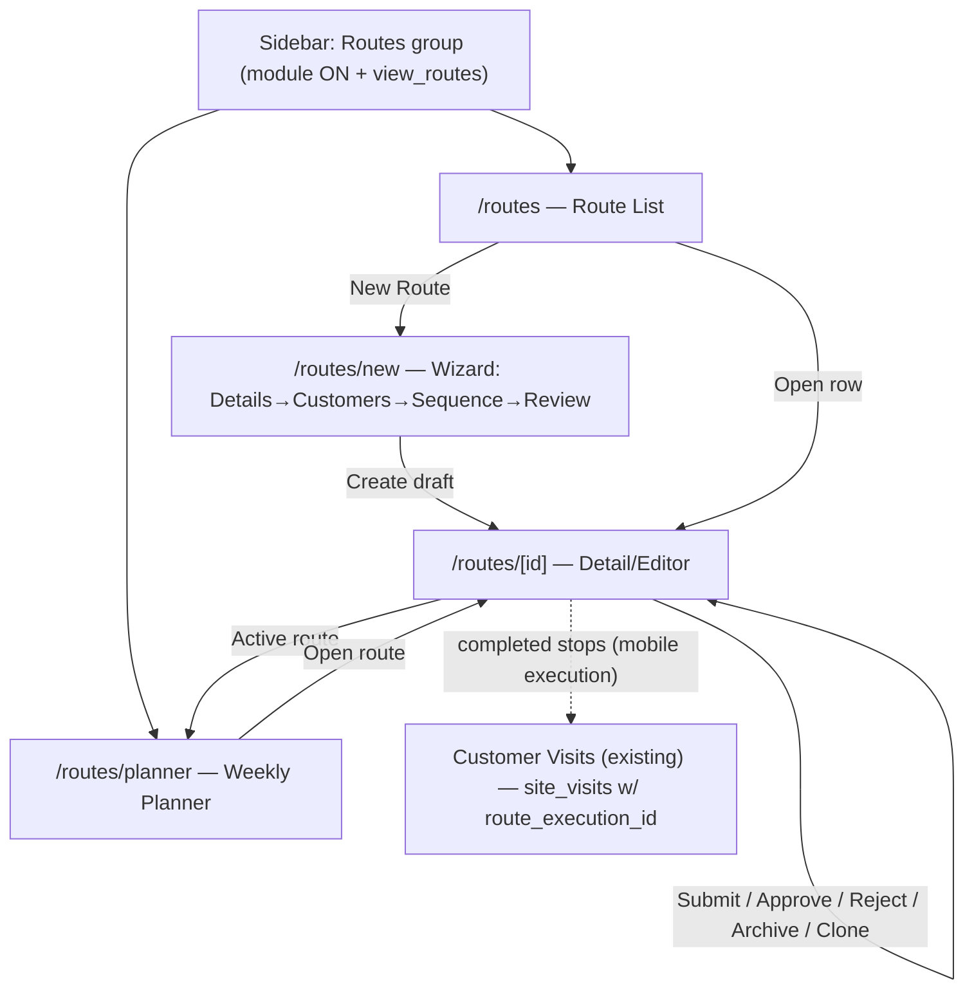

# Route Management — UI Architecture & Screen-Flow Review

**Status:** For CTO approval (required before Phase 2b — Route List — begins)
**Date:** 2026-08-02
**Depends on:** Phase 2a infrastructure (committed `8c1b947`) — Route SDK, hooks, provider,
settings, feature toggle, permissions. Spec: `route-management.md` (Rev 3).

Purpose: agree the web UI architecture and the screen/navigation flows for Phases 2b–2e
**before** any screen is built, so implementation is mechanical.

---

## 1. UI Architecture (how every route screen is built)

**Strict layering (no exceptions):**
```
Screen (page.tsx, server or client)
  → Feature component ("use client")
    → Route hooks (@/hooks/route)        ← React Query: cache, loading, optimistic
      → Route SDK (@/lib/route)          ← the ONLY Supabase caller: validation, errors, retry
        → Supabase RPC → Postgres (RLS + permissions authoritative)
```
- **UI contains zero business logic.** Eligibility, sequencing rules, capacity, approval
  transitions, offline behavior — all already live in the SDK/RPC. Components render state and
  dispatch intents.
- **No component calls `supabase.*` or an RPC directly.** They call hooks; hooks call the SDK.
  (Lint-enforceable later; for now it's a review checkpoint.)
- **State:** server state via React Query (keys in `@/hooks/route/query-keys`); local UI state
  (dialogs, drag state, form drafts) via `useState`. No new global store.
- **Permissions in the UI are for affordance only** (show/hide/disable), via
  `hasRoutePermission` / `useAuth().hasPermission`. The server re-checks every action; a hidden
  button is not a security boundary.
- **Module gate:** every route screen sits behind `isModuleEnabled('route')` (sidebar hides the
  group; `dashboard-shell` redirects `/routes*` when off). With the module off, nothing renders
  and free-visit mode is untouched.

**Design system (house rules — from CLAUDE Web.md):**
- Shadcn UI only (no raw `<button>`/`<input>`); `<DataTable>` family for lists; `<Sheet>` for
  complex forms (slide-from-right), `<Dialog>` for 1–2 field confirms; the shared `<Timeline>`
  for audit; `gated-button` for permission-aware actions.
- Full-width screens (`w-full`, no `max-w-2xl` wrappers); responsive multi-column grids.
- Dark-mode-first, no white flash; loading skeletons for every async area.
- House **detail layout**: header card + two-column body with left tabs and the shared
  `<Timeline>` pinned right (same as the lead/order detail pages).

**Cross-cutting states every screen must implement** (founder rule): loading, empty,
populated, partial-error, full-error, permission-denied, and — where the data is a mutation —
saving/optimistic + rollback. Web is online-first; the offline states are a **mobile** concern
(Phase 3), except that web surfaces the SDK's `network` error kind gracefully.

---

## 2. Screen inventory (Phases 2b–2e)

| # | Route | Screen | Phase | Primary hook(s) | Gate |
|---|---|---|---|---|---|
| 1 | `/routes` | Route List | 2b | `useRoutes` | module + `view_routes` |
| 2 | `/routes/new` | Route Wizard (create) | 2b | `useSaveRoute`, `useImportCustomers` | `add_routes` |
| 3 | `/routes/[id]` | Route Detail / Editor | 2b | `useRoute`, `useRouteCustomers`, `useRouteHealth`, mutations | `view_routes` (edit gated) |
| 4 | `/routes/planner` | Weekly Planner | 2c | `usePlanner`, `usePlannerSet/Clear/Move` | `assign_routes`/`manage_route_schedule` |
| 5 | `/routes/[id]` (Approval affordances) | Approval actions + Pending filter | 2e | `useUpdateRouteStatus` | `approve_routes` |
| — | Execution (Today's Route, stops) | **Mobile, Phase 3** | — | `useTodayRoute`, execution mutations | `execute_route` |

**Note on 2d (Execution UI):** the spec makes execution **mobile-first** (offline). On **web**,
execution is *observed*, not performed — completed stops already appear in the existing
**Customer Visits** screen (they create `site_visits` with `route_execution_id`). So Phase 2d on
web = a **read-only execution/monitoring view** (or simply richer columns on Customer Visits),
not a "run the route" screen. **Decision D4 below.**

### 2.1 Route List (`/routes`)
- **Layout:** page header ("Routes" + "New Route" `gated-button` on `add_routes`) + `<DataTable>`.
- **Columns:** Name · Primary assignee · Status pill · #Customers · **Health** (score chip) ·
  Updated · row actions (Open, Clone, Archive/Restore — gated). Status filter (draft / pending /
  active / archived) + "Show archived" off by default.
- **Health chip:** small colored score from `useRouteHealth` — but computing health per row = N
  RPC calls. **Decision D2:** either (a) lazy per-row (only when a row is expanded/hovered), or
  (b) a batch health read, or (c) show health only on the detail page for V1. Recommend (c) for
  the list + full panel on detail (cheapest, avoids N+1).
- **States:** loading skeleton rows; **empty** ("No routes yet — create your first beat" + CTA);
  filtered-empty; error banner with retry; permission-denied (no `view_routes` → the sidebar
  entry is already hidden, and the page redirects).

### 2.2 Route Wizard (`/routes/new`)
- **Why a wizard:** creating a usable route is inherently multi-step (name+assignee → import
  customers → sequence → review). A wizard keeps each step simple (founder's "usable by a
  non-technical admin, max 3 clicks for common tasks").
- **Steps:** (1) **Details** — name, description, primary assignee (employee picker). (2)
  **Customers** — Import All (default) / Select, drawing from the assignee's territory
  (eligibility enforced server-side; UI shows the returned added/skipped counts). (3)
  **Sequence** — drag-and-drop order (`@dnd-kit`). (4) **Review & Create** — summary + "Create"
  (saves `draft`; then Submit/Activate per approval mode).
- **Implementation:** one client component holding wizard state; each "Next" is local until the
  final create, OR create the draft route at step 1 and enrich (so import/sequence use real ids).
  **Decision D1:** create-early (real route id from step 1 — simplest, matches `route_upsert`
  idempotency and lets import/reorder RPCs run per step) vs. buffer-all-then-create. Recommend
  **create-early** as a `draft`.
- **States:** per-step validation (inline), assignee-missing guard before import, import result
  toast (with skipped counts), save error mapping (duplicate-name warning is non-blocking).

### 2.3 Route Detail / Editor (`/routes/[id]`)
- **Layout:** house pattern — header card (name, assignee, **status pill**, **Health score
  badge**, action buttons) + left tabs **Customers / Schedule / Health** + `<Timeline>` right
  (module_name `'route'`, enriched via a separate profiles query — the auth.users embed gotcha).
- **Customers tab:** `@dnd-kit` sortable list (optimistic reorder via `useReorderCustomers`),
  Add / Import / Remove (gated), search/filter, capacity banner (warn vs block per settings).
- **Schedule tab:** shows this route's planner assignments (read + quick assign); full grid is
  the Planner screen.
- **Health tab/panel:** `useRouteHealth` → score + the list of active warnings (all non-blocking).
- **Header actions (status machine, gated):** Submit (`draft`, `edit_routes`), Approve/Reject
  (`pending_approval`, `approve_routes`), Archive/Restore (`archive_routes`), Clone
  (`clone_routes`). Archived route → read-only with a Restore action.
- **States:** loading skeleton; not-found; permission-denied (can view but not edit → controls
  disabled via `gated-button`); optimistic reorder with rollback; concurrency conflict (SDK
  `concurrency` error → "changed by someone else, reload").

### 2.4 Weekly Planner (`/routes/planner`)
- **Layout:** grid — salesman rows × Mon–Sun columns; each cell shows the assigned route chip or
  an empty "Off" slot. `@dnd-kit` to assign/move a route chip into a cell; clear removes it.
- **Actions:** assign (`plannerSet`), move (`plannerMove` — atomic), clear (`plannerClear`),
  copy (assign same route to another cell). Only `active` routes are assignable (server-enforced;
  UI shows an active-routes palette).
- **Responsive:** desktop = grid; on narrow widths collapse to a per-salesman day list (mobile
  planner parity comes in Phase 3). **Decision D3:** confirm desktop-grid + responsive-list.
- **States:** loading; empty (no active routes → "Activate a route to schedule it"); assign
  conflict warning; permission-denied.

### 2.5 Approval UI (`/routes` + `/routes/[id]`)
- **Not a separate app** — approvals are a **filter + actions**: a "Pending approval" quick
  filter on the list, and Approve/Reject buttons on the detail header (gated `approve_routes`).
  Reject opens a small `<Dialog>` for a reason (logged to the audit `details`).
- A "Suggested approver" line shows on a pending route when `approval_mode='manager'` (reuses
  `get_approver`); if none resolves, an explicit "needs an admin" state (never a silent dump).
- **Comments/Audit:** the `<Timeline>` already renders every status change with reason — that's
  the approval trail; no separate comments system in V1.

---

## 3. Navigation flow



**Route status → UI affordances**

| Status | List badge | Detail actions available |
|---|---|---|
| draft | grey | Edit, Submit (if approval) / Activate (if none), Delete (no executions), Clone |
| pending_approval | amber | Approve, Reject (approver); read-mostly for others |
| active | green | Edit, Archive, Clone, assignable in Planner |
| rejected | red | Reopen to draft, Edit |
| archived | muted | Restore only; otherwise read-only |

---

## 4. Reuse plan

**Reuse (search before building):** `<DataTable>` family, `<Timeline>`, `gated-button`,
`<Sheet>`/`<Dialog>`, `<Select>`, the employee/assignee picker used elsewhere, the settings-panel
pattern (done), the house detail layout (lead/order pages), `formatCurrency`/date helpers.
**New, justified:** `@dnd-kit` sortable (customer sequencing + planner) — the one approved new
dependency; a `RouteStatusPill`, `RouteHealthPanel`, `RoutePlannerGrid`, `CustomerImportDialog`,
`RouteWizard`. All consume the Phase 2a hooks; none touch Supabase.

**Feature-toggle extensibility (refinement 4):** the master switch stays a single boolean
(`module_settings.route`). Future **sub-module** toggles (e.g. planner-only, execution-only,
approval-required-per-team) live in the already-extensible `accounts.settings.route_settings`
jsonb — additive keys, no schema/migration churn, read through the existing settings API. No
speculative sub-toggles are built now.

---

## 5. Definition of Done per UI phase (testing standard)

Each of 2b–2e ships with: component/unit tests (rendering + gating + state branches), hook
integration tests (mocked SDK — cache/optimistic/invalidation), permission tests (gated controls
hidden/disabled), and a manual dark-mode + empty/error pass. RLS/permission enforcement is
server-side and already covered by the Phase 1 production smoke test; UI tests assert the SDK is
*called correctly*, not that the DB enforces (that's proven). Regression: `npm test` + `npm run
build` green before moving on.

---

## 6. Decisions to confirm before Phase 2b

- **D1 — Wizard persistence:** create the draft route at step 1 (real id; import/reorder run per
  step) vs. buffer everything and create once at the end. *Recommend: create-early draft.*
- **D2 — Health on the list:** show the health score per row (N+1 cost) vs. only on the detail
  page for V1. *Recommend: detail-only for V1; list shows just the status pill + customer count.*
- **D3 — Planner layout:** desktop grid (salesman × weekday) collapsing to a per-salesman list on
  narrow screens. *Recommend: yes.*
- **D4 — Web execution (Phase 2d):** web gets a **read-only** execution/monitoring view (plan vs
  actual, reusing Customer Visits) rather than a "run the route" screen (running is mobile). *Confirm
  scope so 2d isn't over-built on web.*
- **D5 — Route List default filter:** default to Active + Draft, hide Archived behind a toggle. *Recommend: yes.*

On approval (with D1–D5 settled), Phase 2b (Route List → Wizard → Detail/Editor) begins.
