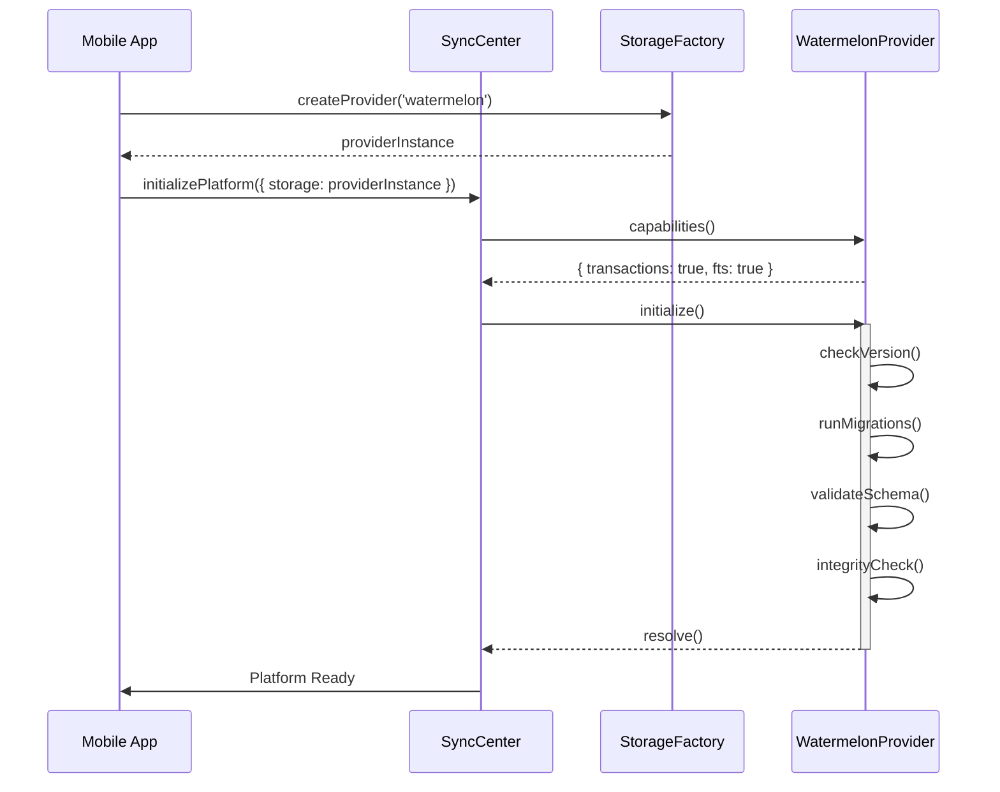
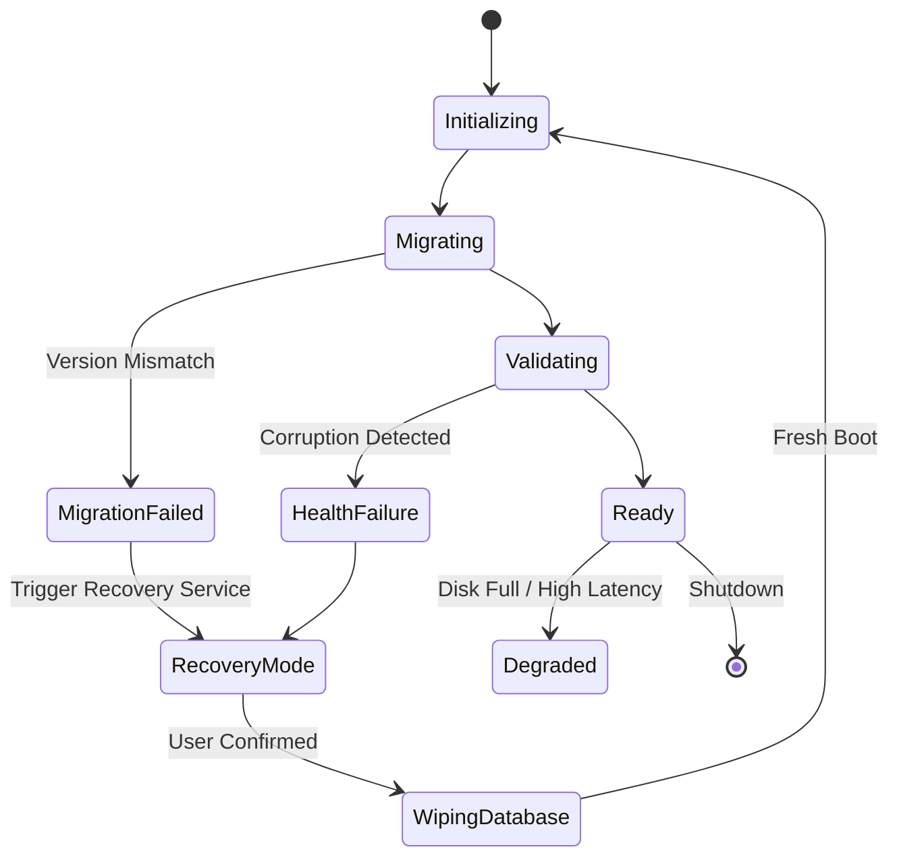

# Storage Architecture Diagrams

## 1. Abstraction Layer (Component Diagram)

```mermaid
graph TD
    subgraph WACRM Mobile App
        UI[React Native UI]
    end

    subgraph Runtime Platform EWO-003
        SC[SyncCenter]
        SQ[SyncQueue]
        DQ[DependencyQueue]
        TM[TransactionManager]
    end

    subgraph Storage Abstraction EWO-004A
        ISM((IStorageManager))
        SF[StorageFactory]
    end

    subgraph Concrete Providers EWO-004B
        WMDB[WatermelonDBProvider]
        SQL[SQLiteProvider]
        MOCK[MockProvider]
    end

    UI --> SC
    SC --> SQ
    SC --> DQ
    SC --> TM

    TM --> ISM
    SQ --> ISM
    SF --> ISM

    ISM <|-- WMDB
    ISM <|-- SQL
    ISM <|-- MOCK
```

## 2. Provider Lifecycle (Sequence Diagram)



## 3. Storage Error Recovery Flow


